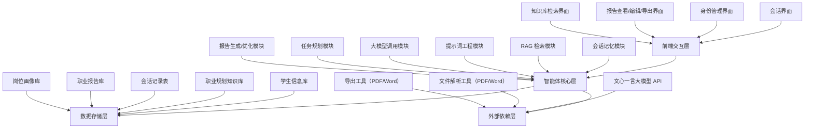
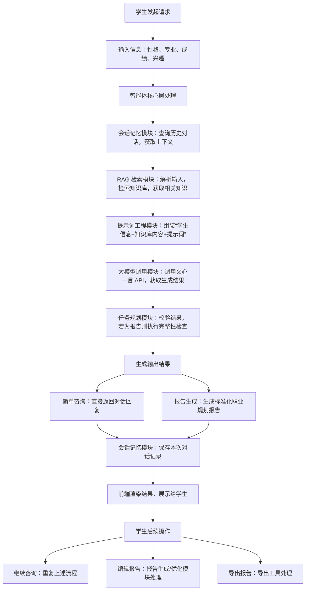

# 基于 RAG 与大模型的大学生职业规划智能体（Agent）系统架构

# 摘要

针对当前大学生职业规划缺乏个性化、专业化指导，以及传统职业咨询效率低、成本高的问题，本文设计并实现了一种基于检索增强生成（Retrieval-Augmented
Generation, RAG）与大语言模型（Large Language Model, LLM）的大学生职业规划智能体（Agent）系统。该系统整合职业规划知识库、学生多维度信息，通过
RAG 技术实现专业知识的精准检索，结合提示词工程（Prompt
Engineering）引导大模型生成定制化职业规划报告，同时具备会话记忆、多身份适配、任务自主执行等核心能力，解决了传统职业规划中“信息不精准、指导不个性、流程不高效”的痛点，为大学生提供全流程、个性化的职业规划服务。本文详细阐述系统的整体架构、各模块设计原理、核心工作流程及关键技术实现，为同类智能体系统的研发提供参考。

# 关键词

RAG；大语言模型；智能体（Agent）；大学生职业规划；提示词工程；个性化指导

# 1 引言

随着高等教育普及化，大学生就业竞争日益激烈，科学合理的职业规划成为提升大学生就业竞争力的关键。当前大学生职业规划主要依赖高校职业咨询中心、专业导师指导或线上通用职业测评工具，存在明显局限性：一是职业咨询资源有限，难以满足大规模学生的个性化需求；二是通用测评工具缺乏针对性，无法结合学生专业、性格、兴趣及行业动态提供精准指导；三是职业知识更新不及时，难以匹配快速发展的行业岗位需求。

近年来，大语言模型（如文心一言、ERNIE-Bot
4.0）的快速发展为智能职业规划提供了技术支撑，但单纯依赖大模型存在“知识滞后、领域性不足、个性化欠缺”等问题。检索增强生成（RAG）技术通过将大模型与专业知识库结合，能够弥补大模型知识更新不及时、领域知识不深入的短板，而提示词工程则可引导大模型按规范输出结构化结果。在此背景下，本文构建了基于
RAG 与大模型的大学生职业规划智能体，整合“知识库检索+学生信息分析+大模型生成+会话记忆”四大核心能力，实现职业规划的个性化、专业化、高效化，助力大学生明确职业目标、规划发展路径。

# 2 系统核心设计理念

本大学生职业规划智能体（Agent）的核心设计理念是“以学生为中心，以知识为支撑，以智能为驱动”，区别于传统的被动式职业咨询工具，具备“记忆、检索、分析、生成、执行”的自主能力，其核心设计遵循以下三大原则：

（1）个性化适配：支持学生建立多重身份（如专业身份、兴趣身份），智能体可根据不同身份的职业诉求，结合学生性格、专业、成绩、兴趣等多维度信息，生成差异化的职业规划方案；

（2）知识精准化：构建专属职业规划知识库，涵盖专业、行业、岗位、薪资、技能要求等核心内容，通过 RAG
技术实现知识的快速检索与精准匹配，确保指导内容的专业性与时效性；

（3）任务自动化：智能体可自主完成“检索知识库→分析学生信息→生成规划报告→提供后续咨询”的全流程任务，无需人工干预，同时具备会话记忆能力，可基于历史对话持续优化指导方案。

本智能体的本质是“RAG+提示词工程+会话记忆+任务工作流”的有机结合，其中 RAG
解决“知识精准性”问题，提示词工程解决“输出规范性”问题，会话记忆解决“个性化延续性”问题，任务工作流解决“任务自主性”问题，四者协同构成标准的领域专属智能体架构。

# 3 系统整体架构设计

本系统采用分层架构设计，从上至下分为前端交互层、智能体核心层、数据存储层、外部依赖层四个层次，各层次职责清晰、协同工作，确保系统的稳定性、可扩展性与可维护性。系统整体架构如图
1 所示（Mermaid 流程图）。

## 3.1 架构总览

图 1 系统整体架构图

## 3.2 各层次详细设计

### 3.2.1 前端交互层

前端交互层基于 uni-app + Vue-TS 开发，面向大学生用户与系统管理员，提供友好、便捷的交互界面，核心功能包括：

（1）会话交互：提供智能体聊天界面，支持学生输入性格、专业、成绩、兴趣等信息，查看智能体的实时回复，实现一对一职业咨询；

（2）身份管理：支持学生创建、编辑、删除多重身份（如“计算机专业学生”“金融量化爱好者”），实现不同身份下的职业规划隔离；

（3）报告管理：支持查看、编辑、智能润色、完整性检查、一键导出职业规划报告，满足学生个性化修改与存档需求；

（4）辅助功能：提供知识库检索、岗位匹配查询、职业路径查看等辅助功能，为学生提供多维度职业参考。

前端交互层通过 RESTful API 与后端智能体核心层通信，实现数据的实时交互与渲染，确保用户体验的流畅性。

### 3.2.2 智能体核心层（核心模块）

智能体核心层是系统的核心，负责实现智能体的“记忆、检索、分析、生成、执行”五大核心能力，整合 RAG 检索、提示词工程、大模型调用等关键技术，各模块职责如下：

#### 3.2.2.1 会话记忆模块

负责存储学生与智能体的所有历史对话记录，实现上下文记忆功能，确保智能体能够记住学生的历史提问、身份信息、职业诉求等内容，为后续个性化指导提供支撑。该模块通过关联“学生-身份-会话”的层级关系，实现会话的隔离存储，避免不同学生、不同身份的对话上下文混淆；同时支持对话历史的查询、回溯，为大模型提供完整的上下文信息。

#### 3.2.2.2 RAG 检索模块

RAG 检索模块是解决大模型领域知识不足、知识滞后的核心模块，负责将学生输入的信息与职业规划知识库进行精准匹配，检索出相关的专业知识（如岗位技能要求、行业发展趋势、薪资水平等），为大模型生成回复提供支撑。其核心流程包括：

1. 信息解析：对学生输入的性格、专业、成绩、兴趣等信息进行解析，提取核心关键词（如“计算机专业”“数据分析”“性格内向”）；

2. 知识库检索：基于关键词，采用向量检索技术（如 FAISS）检索职业规划知识库，获取与学生诉求相关的知识片段；

3. 知识筛选：对检索到的知识片段进行筛选、排序，优先保留与学生身份、职业诉求高度相关的内容，剔除冗余、无关信息；

4. 知识组装：将筛选后的知识片段进行结构化组装，形成可直接喂给大模型的知识内容。

#### 3.2.2.3 提示词工程模块

提示词工程模块负责设计标准化、专业化的提示词（Prompt），引导大模型按规范输出结构化的职业规划内容，避免大模型输出杂乱、不贴合需求的结果。提示词设计遵循“明确任务、提供上下文、规范格式”三大原则，核心内容包括：

1. 角色定义：明确大模型的角色（如“专业大学生职业规划导师”），规范大模型的回复语气与专业性；

2. 上下文提供：将学生信息（性格、专业、成绩、兴趣）、RAG 检索到的知识库内容、学生身份信息等整合为提示词上下文；

3. 任务指令：明确大模型的任务（如“生成个性化职业规划报告”“分析人岗匹配度”“规划职业发展路径”）；

4. 格式规范：指定大模型的输出格式（如 JSON 结构化数据、正式报告文本），确保输出内容可直接用于前端渲染或报告生成。

#### 3.2.2.4 大模型调用模块

负责与外部大模型（本文采用文心一言 ERNIE-Bot 4.0）进行通信，将“学生信息+知识库检索内容+提示词”整合为大模型请求参数，调用大模型
API 获取生成结果，并对结果进行解析、校验，确保结果的准确性与规范性。该模块支持同步/异步调用，可根据任务复杂度（如报告生成、简单咨询）选择不同的调用方式，同时记录调用过程中的
Token 消耗、响应耗时等信息，用于系统优化与成本控制。

#### 3.2.2.5 任务规划模块

负责实现智能体的任务自主规划能力，根据学生的输入诉求，自主决定任务执行步骤，例如：当学生请求生成职业规划报告时，任务规划模块会自主规划“解析学生信息→RAG
检索知识库→组装提示词→调用大模型→生成报告→完整性检查”的全流程步骤，无需人工干预，确保任务高效执行。

#### 3.2.2.6 报告生成/优化模块

负责将大模型生成的内容整理为标准化的职业规划报告，涵盖职业探索与岗位匹配、职业目标设定与路径规划、分阶段行动计划等核心模块；同时提供报告智能润色、完整性检查功能，支持学生手动编辑报告，确保报告的专业性、完整性与个性化。

### 3.2.3 数据存储层

数据存储层采用 PostgreSQL 数据库，负责存储系统运行过程中的所有数据，确保数据的安全性、完整性与可扩展性，核心数据存储模块包括：

（1）学生信息库：存储学生基本信息、多重身份信息、能力画像信息（专业技能、证书、创新能力等）；

（2）职业规划知识库：存储专业、行业、岗位、薪资、技能要求等核心知识，采用结构化+非结构化结合的方式存储，支持快速检索；

（3）会话记录表：存储学生与智能体的历史对话记录，关联学生、身份、会话信息，支持上下文回溯；

（4）职业报告库：存储学生生成的职业规划报告，关联学生身份信息，支持报告的查询、编辑、导出；

（5）岗位画像库：存储各类岗位的画像信息（岗位描述、技能要求、晋升路径等），为岗位匹配与人岗分析提供支撑。

### 3.2.4 外部依赖层

负责提供系统运行所需的外部工具与服务，为智能体核心层提供支撑，核心依赖包括：

（1）文心一言大模型 API：提供大语言模型的生成能力，是智能体实现自然语言交互与内容生成的核心依赖；

（2）文件解析工具：包括 PDF/Word 解析工具，负责解析学生上传的简历文件，提取学生能力信息，用于生成学生能力画像；

（3）导出工具：包括 PDF/Word 导出工具，负责将职业规划报告导出为可下载的文件格式，满足学生存档需求。

# 4 系统核心工作流程

本大学生职业规划智能体的核心工作流程围绕“学生输入→智能体处理→生成结果→后续交互”展开，结合 RAG
检索、提示词工程、会话记忆等技术，实现个性化职业规划服务的全流程自动化，具体流程如下（如图 2 所示）：

图 2 系统核心工作流程

流程详细说明：

1. 学生发起请求：学生通过前端界面输入自身信息（性格、专业、成绩、兴趣），并提出职业规划相关诉求（如“生成职业规划报告”“咨询计算机专业就业方向”）；

2. 上下文获取：会话记忆模块查询该学生该身份下的历史对话记录，获取上下文信息，确保智能体能够结合历史诉求提供连贯的指导；

3. 知识库检索：RAG 检索模块解析学生输入的核心信息，检索职业规划知识库，筛选出与学生诉求相关的知识片段（如计算机专业相关岗位、技能要求、行业趋势等）；

4. 提示词组装：提示词工程模块将学生信息、历史对话、RAG 检索到的知识片段、任务指令整合为标准化提示词，确保大模型能够生成贴合需求的结果；

5. 大模型生成：大模型调用模块将提示词发送至文心一言 API，获取生成结果（对话回复或报告内容），并对结果进行校验，确保结果的准确性与规范性；

6. 结果输出：智能体将生成结果返回至前端，学生可查看对话回复、职业规划报告，进行后续操作（继续咨询、编辑报告、导出报告）；

7. 记忆更新：会话记忆模块保存本次学生提问与智能体回复，为后续对话提供上下文支撑，实现个性化指导的延续性。

# 5 关键技术实现要点

## 5.1 RAG 检索技术实现

本系统采用“关键词检索+向量检索”结合的方式，实现职业规划知识库的精准检索：

1. 知识库构建：将职业规划相关知识（专业、行业、岗位、技能等）整理为结构化数据（如岗位表、技能表）与非结构化数据（如行业分析文档），存储至
   PostgreSQL 数据库；

2. 向量嵌入：采用文心一言的 Embedding API，将知识库中的非结构化文本转换为向量，存储至向量数据库（如 FAISS），用于快速相似性检索；

3. 检索流程：学生输入信息后，先进行关键词检索，筛选出初步相关的知识；再将学生输入转换为向量，进行相似性检索，进一步优化检索结果；最后对检索结果进行排序、筛选，确保知识的相关性与精准性。

## 5.2 提示词工程实现

提示词设计采用“固定模板+动态填充”的方式，确保提示词的规范性与个性化，核心提示词模板如下：

“你是专业的大学生职业规划导师，需基于以下信息，为学生提供个性化职业规划指导，严格遵循以下要求：

1. 学生信息：性格{性格}，专业{专业}，成绩{成绩}，兴趣{兴趣}，身份{身份名称}；

2. 专业知识：{RAG 检索到的知识库内容}；

3. 任务要求：{学生诉求，如生成职业规划报告}；

4. 输出要求：{格式规范，如结构化报告、JSON 数据}。”

通过动态填充学生信息、RAG 检索内容、学生诉求，实现提示词的个性化适配，引导大模型生成贴合学生需求的结果。

## 5.3 会话记忆实现

会话记忆通过“会话表+消息表”的层级结构实现，核心设计如下：

1. 会话表（ChatSession）：关联学生、身份、报告信息，存储会话名称、会话类型、文心会话 ID 等信息，实现会话的隔离；

2. 消息表（ChatMessage）：关联会话信息，存储每一轮对话的角色（用户/AI）、内容、Token 消耗、响应耗时等信息，按时间顺序存储，确保上下文的连贯性；

3. 上下文拼接：每次调用大模型时，从消息表中查询该会话的历史消息，按“用户→AI→用户→AI”的顺序拼接为上下文，与当前用户输入一起喂给大模型，实现会话记忆。

## 5.4 多身份适配实现

通过“学生-身份-会话-报告”的关联关系，实现多身份适配：

1. 学生可创建多个身份，每个身份关联不同的职业方向；

2. 每个身份对应独立的会话记录、职业报告，避免不同身份的信息混淆；

3. RAG 检索与大模型生成时，会结合当前身份的职业方向，筛选相关的知识库内容，生成差异化的职业规划方案。

# 6 系统优势与创新点

## 6.1 优势

（1）个性化程度高：支持多重身份适配，结合学生性格、专业、兴趣等多维度信息，生成差异化的职业规划方案，解决传统职业规划“千人一面”的问题；

（2）知识精准性强：通过 RAG 技术整合职业规划专属知识库，确保指导内容的专业性、时效性，弥补大模型知识滞后、领域性不足的短板；

（3）自动化程度高：智能体可自主完成“检索→分析→生成→优化”的全流程任务，无需人工干预，提升职业规划指导的效率；

（4）交互体验好：具备会话记忆能力，可基于历史对话提供连贯的指导，同时支持报告编辑、润色、导出，满足学生的个性化需求。

## 6.2 创新点

（1）将 RAG 技术与大学生职业规划场景深度结合，构建专属职业规划知识库，实现专业知识的精准检索与个性化匹配；

（2）设计多身份适配机制，支持学生基于不同身份（专业、兴趣）获取差异化职业规划指导，贴合大学生多元化的职业诉求；

（3）整合“RAG+提示词工程+会话记忆+任务规划”，构建标准的领域专属智能体，实现职业规划指导的全流程自动化，区别于传统的被动式咨询工具。

# 7 结论与展望

本文设计并实现了基于 RAG 与大模型的大学生职业规划智能体系统，通过分层架构设计，整合 RAG
检索、提示词工程、会话记忆等关键技术，实现了个性化、专业化、高效化的职业规划指导服务，解决了传统职业规划中存在的痛点。该系统具备良好的稳定性与可扩展性，可为大学生提供全流程的职业规划支撑，同时为同类智能体系统的研发提供参考。

未来的优化方向主要包括三个方面：一是进一步完善职业规划知识库，增加行业动态、企业招聘信息等内容，提升知识的时效性与丰富度；二是优化
RAG 检索算法，提升知识检索的精准性与效率；三是增加更多个性化功能，如职业测评、实习推荐等，进一步提升系统的实用性与针对性，助力大学生更好地规划职业生涯。
> （注：AI 生成）